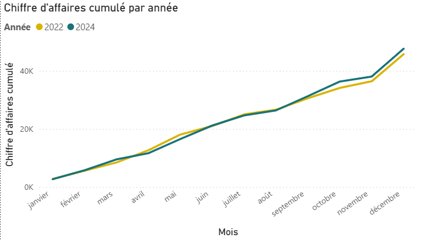
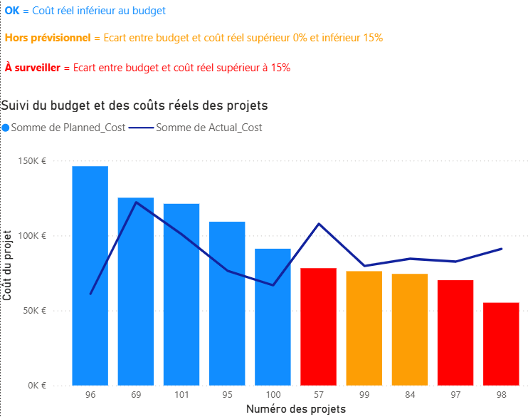

# 📊 Exemples de tableaux de bord Power BI

Cette section présente trois visualisations réalisées dans Power BI dans le cadre de mes projets de data visualisation.  
Elles illustrent mes compétences en **modélisation**, **analyse de performance** et **construction de rapports clairs et interactifs**.

---

## 💎 1. Évolution du chiffre d’affaires cumulé mois par mois

> **Objectif :** suivre mois par mois l’évolution du **chiffre d’affaires cumulé** d’une boutique de bijoux.  
> **Outil :** Power BI  
> **Type de graphique :** courbe cumulative  
> **Résultat :** permet d’identifier rapidement les tendances saisonnières et de comparer la progression de plusieurs années sur une même échelle.

📂 **Contexte :** projet 7 – *Création d’un tableau de bord libre (option B)*.

---

## 🧱 2. Suivi budgétaire des projets

> **Objectif :** comparer les **coûts réels** et **coûts planifiés** des projets afin d’identifier les dépassements budgétaires.  
> **Outil :** Power BI  
> **Type de graphique :** barres comparatives + ligne de suivi  
> **Résultat :** met en évidence les projets à **surveiller** (écart > 15 %) et ceux **hors prévisionnel** (écart entre 0 % et 15 %).

📂 **Contexte :** projet 7 – *Dashboard de suivi des projets et indicateurs de performance.*

---

## 📈 3. Répartition du chiffre d’affaires par activité

> **Objectif :** visualiser la **proportion de chiffre d’affaires** par type d’activité sur plusieurs années.  
> **Outil :** Power BI  
> **Type de graphique :** barres empilées  
> **Résultat :** permet de comparer la contribution des activités principales (ventes boutique, retours, réparations…) et d’observer l’évolution de leur poids dans le temps.

📂 **Contexte :** projet 7 – *Analyse des ventes d’une bijouterie (option libre).*

---

⬅️ [Retour à l’accueil](../index.md)
