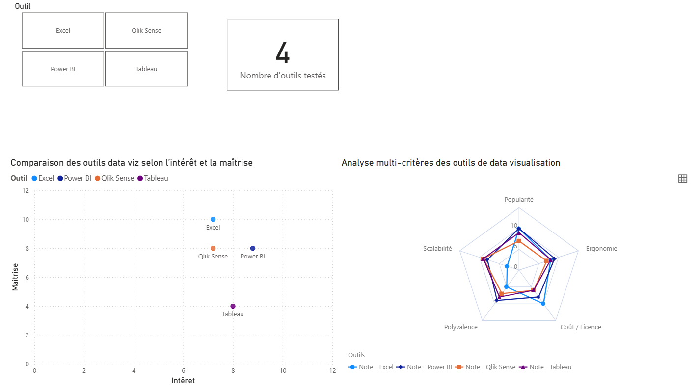
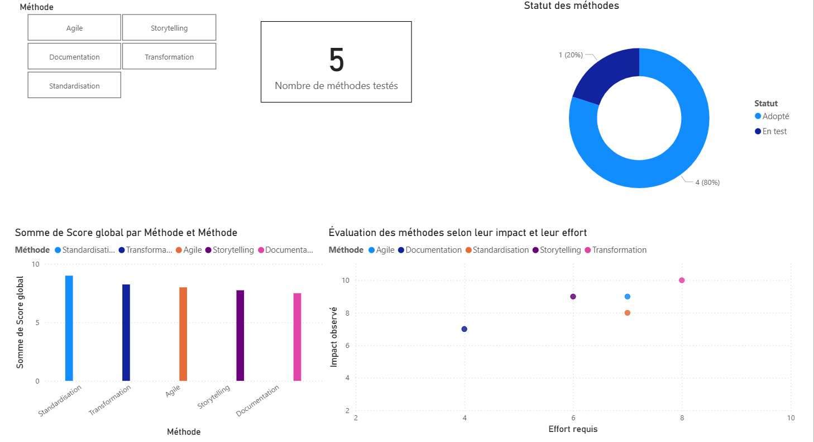

# 📊 Tableaux de bord Power BI – Aéroworld

Ces tableaux de bord ont été conçus pour répondre aux demandes du client **Aéroworld**, dans le cadre d’une **veille métier et technologique**.  
Ils mettent en avant l’expérimentation et la comparaison de différents **outils** et **méthodes de travail**, avec des **indicateurs mesurables** sur l’impact, l’efficacité et la priorisation.

---

## 🧩 1. Tableau de bord – Tests d’outils

> **Objectif :** comparer plusieurs outils de data visualisation selon des critères d’intérêt global et de maîtrise personnelle.  
> **Outils testés :** Power BI, Tableau, Qlik Sense, Excel  
> **Principaux graphiques :**  
> - Nuage de points : *Intérêt global* (popularité, scalabilité, ergonomie, coût, polyvalence) vs *Maîtrise personnelle*  
> - Graphique radar : comparaison multi-critères des outils  
> - KPI : nombre d’outils testés, temps moyen de prise en main  

📊 **Résultat :** ce tableau de bord illustre ma capacité à structurer une **veille technologique active**, à évaluer objectivement les outils et à représenter la synthèse sous forme d’indicateurs visuels clairs.

---

## ⚙️ 2. Tableau de bord – Tests de méthodes

> **Objectif :** évaluer et prioriser les méthodes de travail expérimentées dans le cadre du projet Aéroworld.  
> **Méthodes testées :** Agile, Storytelling visuel, Transformation, Standardisation, Documentation.  
> **Principaux graphiques :**  
> - Nuage de points : *Impact* vs *Effort* (priorisation des méthodes)  
> - Radar multi-critères : gain de temps, simplicité, satisfaction, reproductibilité, clarté  

📈 **Résultat :** ce tableau de bord met en avant une **démarche expérimentale mesurable**, fondée sur l’analyse de l’impact et de la faisabilité de chaque méthode, démontrant une **posture de consultant Data**.

---

⬅️ [Retour à l’accueil](index.md)
