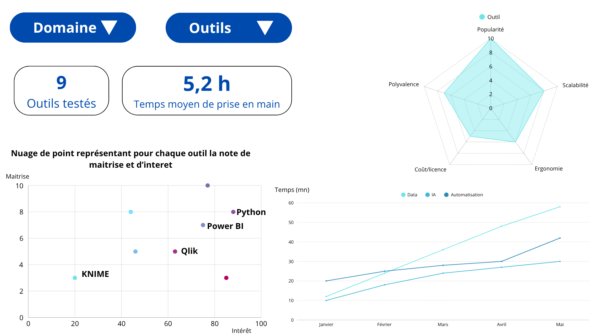
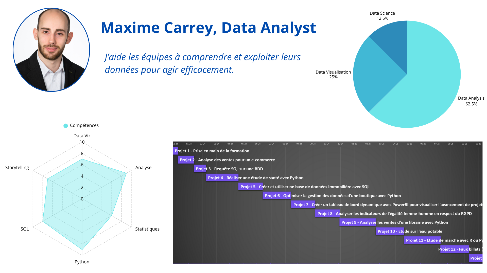

# 🎨 Mock-ups de tableaux de bord – Aéroworld

Ces maquettes ont été conçues dans le cadre du projet **Aéroworld**, afin de définir la structure et la logique visuelle avant le développement des tableaux de bord Power BI.  
Elles ont permis de cadrer les **besoins utilisateurs**, de valider les **indicateurs clés**, et d’anticiper la **navigation et le storytelling** du futur dashboard.

---

## 🧭 1. Tableau de bord – Veille métier

> **Objectif :** centraliser la veille technologique et les tendances du secteur Data.  
> **Contenu :** suivi des outils, technologies, métiers, et indicateurs de maturité.  
> **Outil de conception :** Canva.  
> **Utilité :** prototype pour un tableau de bord de veille accessible et interactif.

📄 [Télécharger le mock-up (PNG)](assets/images/Dashboard_veille_metier.png)

---

## 🙋‍♂️ 2. Tableau de bord – Présentation personnelle

> **Objectif :** concevoir un tableau de bord interactif pour **présenter mon profil, mes compétences et mes projets**.  
> **Contenu :** carte radar de compétences, indicateurs de progression, graphiques de parcours.  
> **Outil de conception :** Canva.  
> **Utilité :** maquette servant de modèle de présentation professionnelle.

📄 [Télécharger le mock-up (PNG)](assets/images/mockups/Dashboard_presentation.png)

---

🎯 Ces deux mock-ups ont servi de base au **cahier des charges Aéroworld**, pour valider la cohérence des indicateurs et la mise en page avant la phase de développement Power BI.

⬅️ [Retour à l’accueil](index.md)
